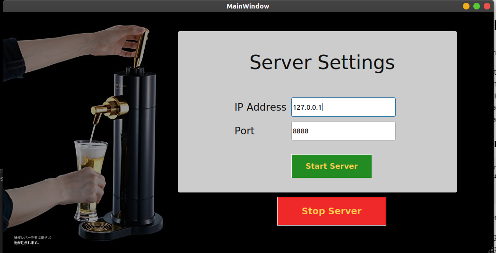
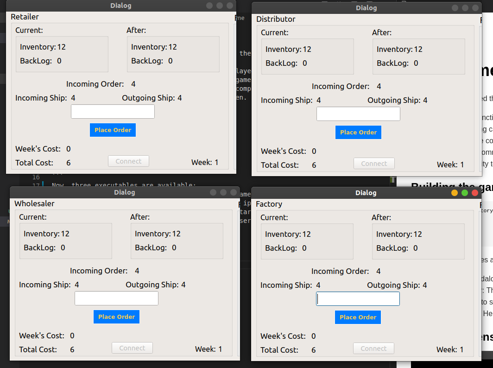

##### se-03-team-24
# Beer Game

In this sprint, we added these main features in the repository that we received:
* Created a fully functional game that can be played locally.
* Adding networking capabilities such that the game can be hosted on a server and players can play in LAN in multiple computers. 
* Added relevant comments in the code for doxygen.
* Added functionality tests for the game.

### Building the game
```
cd {to-project-directory}
mkdir build
cmake ..
make
```
Now, three executables are available:
* beergame : Standalone executable to play the game in a single computer
* beergame-server: This provides selection of an ip-address and a port, such that clients can run *beergame-client* to start the game.
* beergame-client: Helps to connect to beergame-server to play the game.

### Sample screenshots of the game

#### Server:

#### Client:
